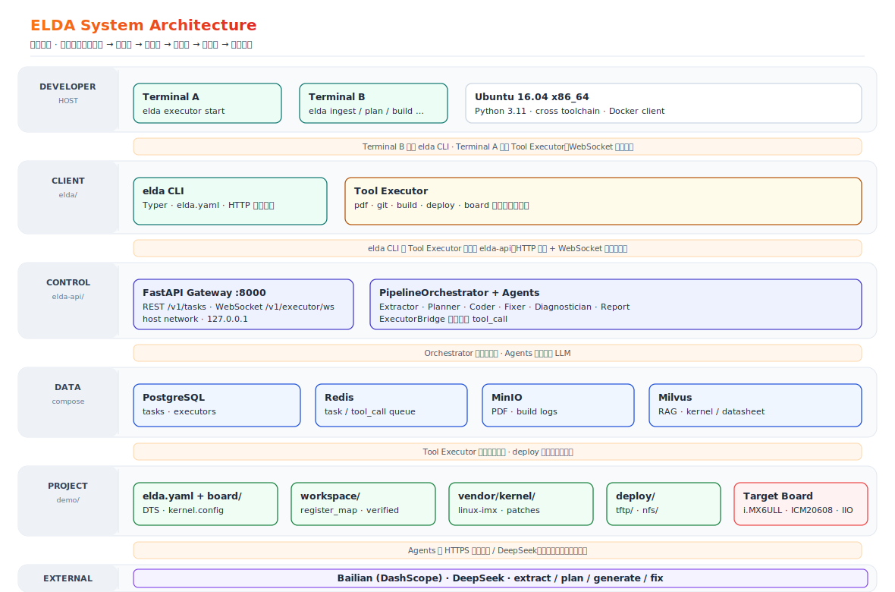

<p align="center">
  
</p>

<p align="center">
  <strong>Embedded Linux Driver Agent</strong><br/>
  <strong>嵌入式Linux驱动开发辅助工具</strong><br/>
</p>

<p align="center">
  <a href="https://github.com/ZHChen2000/embeded-linux-agent/actions/workflows/ci.yml"></a>
  <a href="DEPENDENCIES.txt"></a>
  
  
  
</p>

<p align="center">
  <a href="docker-compose.yml"></a>
  
  
  
  
</p>

<p align="center">
  <br/>
  <a href="quickStart.md">
    
  </a>
  <br/><br/>
</p>

---

## 概述

ELDA（Embedded Linux Driver Agent）面向嵌入式Linux外设驱动开发场景，提供数据手册解析、硬件设备信息抽取、板级信息检查、内核裁剪与编译、设备树生成、驱动源码编写、交叉编译及部署等多种工具，并可通过模型路由及Agent编排完成定制化工作流构建。

本工具包含三个主要组成部分：

| 组件 | 路径 | 功能 |
|------|------|------|
| elda CLI | `elda/` | 本地命令行与Tool Executor，在内核源码所在的宿主机上执行编译、设备树编译、git apply等操作 |
| elda-api | `elda-api/` | 云端Agent编排服务，承载Agent任务调度、PostgreSQL任务状态、Redis队列、Milvus向量检索、MinIO上下文存储等功能 |
| Demo | `demo/icm20608-imx6ull/` | 基于NXP i.MX6ULL与InvenSense ICM20608的参考工程 |

ELDA采用**双终端协作模型**：一台终端运行`elda executor start`注册本地执行器；另一台终端提交`elda ingest`、`elda plan`、`elda generate`、`elda build`等任务。云端API通过WebSocket向Executor下发工具调用，Executor在本机内核源码中执行构建、编译等操作并回传结果。

## 系统架构

<p align="center">
  
</p>

ELDA在逻辑上分为**开发者宿主机**、**客户端层**、**控制平面**、**数据平面**与**工程工作区**五层，各层职责如下。

| 层级 | 组件 | 职责 |
|------|------|------|
| 开发者宿主机 | Terminal A / Terminal B | 终端A运行Executor服务；终端B提交`elda`任务并向终端A轮询状态 |
| 客户端层 | `elda/` CLI + Tool Executor | 解析`elda.yaml`、调用API；在本机执行PDF解析、交叉编译等工具 |
| 控制平面 | `elda-api/` FastAPI + Agents | `PipelineOrchestrator`调度ingest/plan/generate/build/deploy等任务；多Agent负责抽取、规划、编码、修复与报告 |
| 数据平面 | PostgreSQL / Redis / MinIO / Milvus | 任务与Executor注册、工具调用队列、上下文信息与日志对象存储、datasheet手册RAG向量检索 |
| 工程工作区 | `demo/icm20608-imx6ull/` | `workspace/`硬件描述信息、`vendor/kernel/`内核源码、`deploy/`编译产物/镜像文件 |

**典型数据流（ingest → deploy）：**

1. **Terminal B**通过HTTP向`elda-api`提交任务；Orchestrator按任务类型调用对应Agent。
2. 需访问本机文件或编译器时，**Executor Bridge**经Redis队列下发`tool_call`；**Terminal A**的Executor经WebSocket拉取并执行，结果回写API。
3. Agent读取/写入`workspace/`与`reports/`；生成阶段通过`git.apply_patch`修改`vendor/kernel/`；构建阶段调用`build.make_module`、`build.dtc`、`build.make_zimage`。
4. 数据手册Markdown与构建日志写入**MinIO**；相关数据片段嵌入**Milvus**供RAG检索；任务状态持久化至**PostgreSQL**。
5. `elda deploy`将`zImage`、dtb与驱动模块传至`deploy/tftp`、`deploy/nfs`，供目标板启动验证。

外部**百炼**与**DeepSeek** API由`elda-api`内模型路由层调用，不在Docker栈内自托管。

## 系统要求

### 硬件

- x86_64架构宿主机，建议≥2核CPU、≥4GB内存、≥20GB可用磁盘
- arm架构开发机（NXP i.MX6ULL）、串口线、以太网线

### 软件

- 操作系统：Ubuntu16.04 LTS
- Python3.11
- Docker Engine、docker-compose 1.27
- 交叉编译工具链：`gcc-arm-linux-gnueabihf`
- 内核构建依赖：`bc`、`bison`、`flex`、`libssl-dev`、`libncurses5-dev`、`device-tree-compiler`
- PDF解析：`pymupdf`（pip）与`poppler-utils`（pdftotext）
- LLM API密钥：阿里云百炼与DeepSeek

具体版本信息见仓库根目录`DEPENDENCIES.txt`。

## 仓库结构

```
embeded-linux-agent/
├── elda/                 # CLI与Executor
├── elda-api/             # FastAPI编排服务
├── demo/icm20608-imx6ull/
│   ├── elda.yaml         # Demo工程配置
│   ├── board/            # 板级DTS与内核.config
│   ├── vendor/kernel/    # 内核源码
│   ├── docs/             # 用户放置外设数据手册PDF
│   └── scripts/          
├── scripts/              # 环境安装与quickstart脚本
├── schemas/              # Agent输出JSON Schema
├── secrets/              # API密钥模板
└── docker-compose.yml    # PostgreSQL、Redis、MinIO、Milvus、elda-api
```


## 获取源码

```bash
git clone https://github.com/ZHChen2000/embeded-linux-agent
cd embeded-linux-agent
```

## 安装

### 本仓库已内置安装脚本

```bash
bash scripts/quickstart.sh
```

该脚本依次执行系统依赖安装、环境自检、Docker构建与启动、Demo内核拉取与bootstrap。

### 也可根据需要选择分步安装

```bash
# 1. 主机依赖、Python3.11、elda包
bash scripts/install_deps_ubuntu1604.sh

# 2. 自检（注意，这里要source ~/.bashrc后再执行）
bash scripts/verify_install.sh

# 3. API密钥
cp secrets/api_keys.example.yaml secrets/api_keys.yaml
# 编辑 secrets/api_keys.yaml

# 4. 启动服务栈
bash scripts/compose.sh up -d --build
curl -s http://127.0.0.1:8000/health

# 5. Demo配置
cd demo/icm20608-imx6ull
cp /path/to/ICM20608_datasheet.pdf docs/icm20608.pdf
bash scripts/bootstrap_demo.sh
```

## Demo工程配置

Demo目录已包含完整配置文件：

| 文件 | 说明 |
|------|------|
| `elda.yaml` | 工程元数据、外设定义、部署路径、构建选项 |
| `board/imx6ull-elda-demo.dts` | i.MX6ULL板级设备树，含ECSPI3挂接ICM20608 |
| `board/kernel.config.fragment` | 内核配置项，bootstrap时将会写入内核配置文件`.config` |

### 内核源码准备

`demo/icm20608-imx6ull/vendor/kernel/`在仓库中仅为占位目录，使用前必须准备完整内核源码：

**方式一：通过内置脚本拉取**

```bash
cd demo/icm20608-imx6ull
bash scripts/fetch_kernel.sh
```

默认克隆NXP官方仓库分支`imx_4.1.15_2.0.0_ga`：

```bash
git clone --depth 1 -b imx_4.1.15_2.0.0_ga \
  https://github.com/nxp-imx/linux-imx.git vendor/kernel
```

**方式二：使用已有BSP内核树**

将已有内核源码放入`vendor/kernel/`，或修改`elda.yaml`中`target.kernel_source`指向其绝对路径。注意，内核源码需初始化为git仓库，ELDA将通过`git apply`管理补丁。

随后执行：

```bash
bash scripts/bootstrap_demo.sh
```

bootstrap将板级设备树复制进内核源码路径中，并合并内核配置、创建git分支，随后对`elda/icm20608-imx6ull`提交初始变更。

## 运行Demo流水线

注意，所有`elda`命令均在`demo/icm20608-imx6ull/`目录下执行。

**终端A — 启动Executor**

```bash
cd demo/icm20608-imx6ull
elda executor start
```

**终端B — 执行具体任务**

```bash
cd demo/icm20608-imx6ull
elda ingest
elda verify workspace
elda board add
elda plan
elda generate all
elda build
elda deploy
```

各任务含义如下：

| 命令 | 作用 |
|------|------|
| `elda ingest` | 解析`docs/icm20608.pdf`，生成`workspace/`硬件信息描述文件 |
| `elda verify workspace` | 此处需要人工审核辅助，写入`.verified`标记 |
| `elda board add` | 板级SPI/GPIO资源冲突检测 |
| `elda plan` | 生成驱动实现方案至`reports/driver_plan.md` |
| `elda generate all` | 生成驱动源码、设备树节点及内核Kconfig文件 |
| `elda build` | 生成交叉编译产物、设备树镜像dtb、内核镜像zImage |
| `elda deploy` | 拷贝产物至`deploy/tftp`，随后生成检查清单 |


## 配置说明

### elda.yaml

Demo配置使用路径：

- `target.kernel_source: vendor/kernel`
- `board.dts: vendor/kernel/arch/arm/boot/dts/imx6ull-elda-demo.dts`
- `deploy.tftp.directory: deploy/tftp`

模型API密钥通过环境变量调用：`${BAILIAN_API_KEY}`、`${DEEPSEEK_API_KEY}`，或在`secrets/api_keys.yaml`中配置后由CLI自动调用。

### docker-compose服务

| 服务 | 端口 | 用途 |
|------|------|------|
| postgres | 5432 | 任务与Executor注册 |
| redis | 6379 | 任务队列 |
| minio | 9000/9001 | 上下文信息与日志对象存储 |
| milvus | 19530 | RAG向量检索 |
| elda-api | 8000 | HTTP/WebSocket API |

注意，此处`elda-api`使用`network_mode: host`通过`127.0.0.1`访问上述服务。

## 开发与测试

```bash
pip install -e "./elda[dev]" -e "./elda-api[dev]"
pytest elda/tests elda-api/tests -q -m "not integration"
ruff check elda/elda elda-api/app
```

集成测试：

```bash
export ELDA_RUN_INTEGRATION_TESTS=1
pytest elda-api/tests -m integration -v
```


## 许可证

Apache-2.0，见`LICENSE`。

## 相关文档

- `quickStart.md`：快速开始与Demo运行指南
- `DEPENDENCIES.txt`：版本清单

---

<p align="center">
  
</p>


<p align="center">
  <a href="https://github.com/ZHChen2000"></a>
  <a href="mailto:zhchen2000@foxmail.com"></a>
  
</p>

<p align="center"><br/></p>
