<p align="center">
  
</p>

<p align="center">
  <strong>快速上手指南</strong><br/>
</p>

<p align="center">
  <a href="https://github.com/ZHChen2000/embeded-linux-agent/actions/workflows/ci.yml"></a>
  
  
  
  
  
  
</p>

<p align="center">
  <sub>项目详细信息见<a href="README.md">README.md</a> · 本文档阅读时间预计15分钟左右</sub>
</p>

---


## 零：开始前的准备工作

- Ubuntu16.04 x86_64虚拟机或物理机
- 虚拟机可访问公网
- 阿里云百炼与DeepSeek的API密钥
- NXP I.MX6ULL开发板、串口线、以太网线（可选）

## 第一步：获取源码

```bash
git clone https://github.com/ZHChen2000/embeded-linux-agent
cd embeded-linux-agent
```

<p align="center">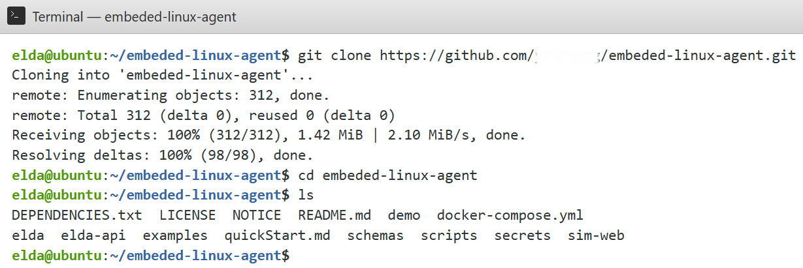</p>

**图1** 克隆仓库并进入工程根目录。

## 第二步：环境配置

```bash
bash scripts/quickstart.sh
```

`quickstart.sh`内部依次调用：

| 步骤 | 脚本/动作 | 产出 |
|------|-----------|------|
| 1 | `install_deps_ubuntu1604.sh` | Python3.11、pyenv、ripgrep、docker-compose1.29.2、elda CLI |
| 2 | `verify_install.sh` | 环境自检报告 |
| 3 | 复制`secrets/api_keys.example.yaml` | `secrets/api_keys.yaml`（需编辑） |
| 4 | `compose.sh up -d --build` | postgres、redis、minio、milvus、elda-api容器 |
| 5 | `demo/.../bootstrap_demo.sh` | 拉取内核、安装DTS与.config、创建Demo目录 |

<p align="center">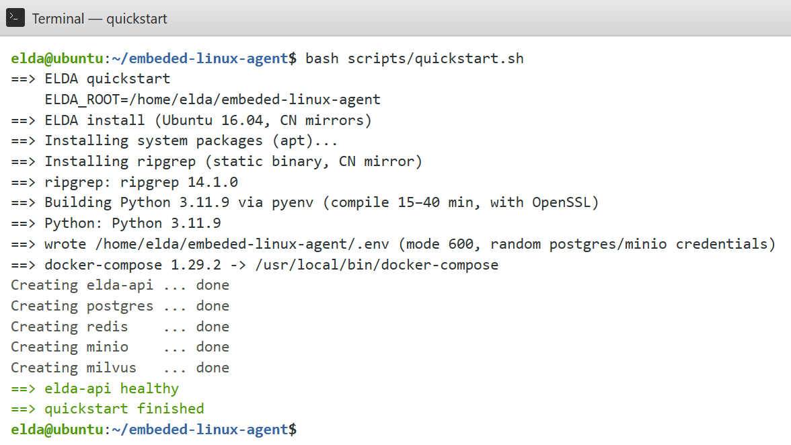</p>

**图2** 执行`quickstart.sh`脚本。

**注意，安装过程中将会自动下载以下内容：**

- pyenv与Python3.11.9源码编译产物（`~/.pyenv/`）
- OpenSSL 1.1.1w 链接模块（`~/.local/openssl-1.1.1w/`）
- ripgrep 14.1.0（`/usr/local/bin/rg`）
- docker-compose 1.29.2（`/usr/local/bin/docker-compose`）
- 相关Python依赖（typer、fastapi、pymilvus等，见`DEPENDENCIES.txt`）
- Docker镜像：postgres:15-alpine、redis:7-alpine、minio/minio、milvusdb/milvus:v2.3.4、elda-api本地build
- NXP linux-imx内核源码（`demo/icm20608-imx6ull/vendor/kernel/`，约1GiB+）


## 第三步：配置API密钥

```bash
vi secrets/api_keys.yaml
```

填入`bailian.api_key`与`deepseek.api_key`。也可导出环境变量：

```bash
export BAILIAN_API_KEY=sk-...
export DEEPSEEK_API_KEY=sk-...
```

确认API可用：

```bash
curl -s http://127.0.0.1:8000/health
```


执行环境自检：

```bash
bash scripts/verify_install.sh
elda doctor
```

<p align="center">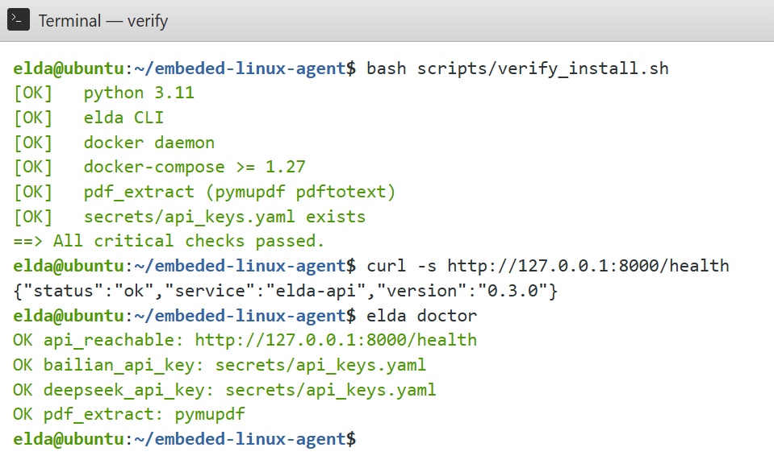</p>

**图3** 确保密钥配置正确且API服务可达。

## 第四步：准备Demo外设资料与内核源码

### 4.1 数据手册PDF

`demo/icm20608-imx6ull/docs/icm20608.pdf`该文件受版权约束，不在仓库内，需用户自行准备InvenSense ICM20608官方数据手册：

```bash
cp /path/to/ICM20608_datasheet.pdf demo/icm20608-imx6ull/docs/icm20608.pdf
```

### 4.2 内核源码

仓库中`demo/icm20608-imx6ull/vendor/kernel/`仅为空占位目录。`quickstart.sh`已尝试通过`fetch_kernel.sh`自动克隆；若失败或未执行quickstart，请手动拉取：

```bash
cd demo/icm20608-imx6ull
bash scripts/fetch_kernel.sh
```

或手动执行：

```bash
cd demo/icm20608-imx6ull
git clone --depth 1 -b imx_4.1.15_2.0.0_ga \
  https://github.com/nxp-imx/linux-imx.git vendor/kernel
```

若已有符合版本的内核源码，可直接放入`vendor/kernel/`，或修改`elda.yaml`中的`target.kernel_source`。

### 4.3 安装板级描述文件

```bash
cd demo/icm20608-imx6ull
bash scripts/bootstrap_demo.sh
```

bootstrap执行：

- 将`board/imx6ull-elda-demo.dts`复制到`vendor/kernel/arch/arm/boot/dts/`
- 将`board/kernel.config.fragment`作为内核`.config`并运行`olddefconfig`
- 创建git分支`elda/icm20608-imx6ull`并提交

<p align="center">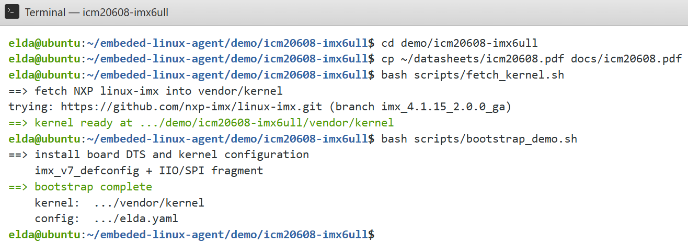</p>

**图4** 在`demo/icm20608-imx6ull`下放置数据手册、执行`fetch_kernel.sh`拉取NXP linux-imx，再执行`bootstrap_demo.sh`将DTS与内核配置写入`vendor/kernel`，末尾显示`bootstrap complete`。


## 第五步：运行Demo

ELDA采用双终端协作：终端A启动Executor服务，终端B提交任务，云端API经WebSocket向Executor下发编译、PDF解析等工具调用。

### 终端A — 启动Executor

```bash
cd demo/icm20608-imx6ull
elda executor start
```

保持终端A运行，等待输出`Waiting for tool calls…`。

<p align="center">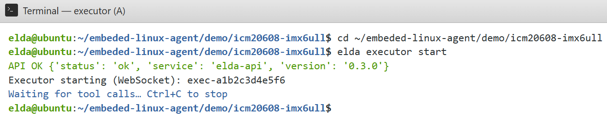</p>

**图5** 终端A：`elda executor start`后显示`API OK`与`Waiting for tool calls…`，表示Executor已注册并等待工具调用。

### 终端B — ingest

```bash
cd demo/icm20608-imx6ull
elda ingest
```

<p align="center">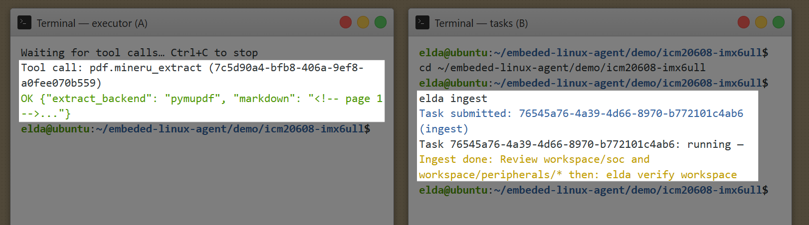</p>

**图6** 双终端协作：`elda ingest`提交解析任务；终端A出现`pdf.mineru_extract`工具调用；终端B任务完成后提示审查`workspace/`并执行`elda verify workspace`。

### 终端B — verify与board

```bash
elda verify workspace
elda board add
```

<p align="center">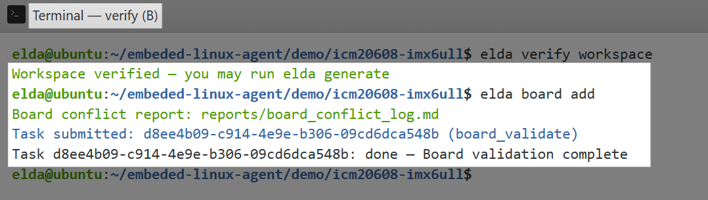</p>

**图7** 人工确认硬件事实文件后`elda verify workspace`通过；`elda board add`生成冲突报告并完成板级校验任务。

### 终端B — plan与generate

```bash
elda plan
elda generate all
```

<p align="center">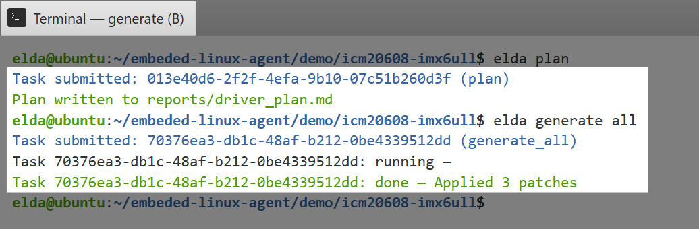</p>

**图8** `elda plan`将驱动方案写入`reports/driver_plan.md`；`elda generate all`生成驱动、DTS与Kbuild补丁并git apply至`vendor/kernel`。

### 终端B — build

```bash
elda build
```

<p align="center">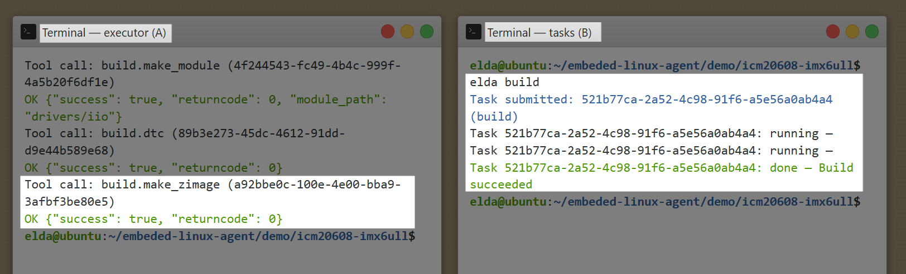</p>

**图9** 双终端协作：`elda build`触发模块编译、设备树编译与`zImage`构建；终端A依次执行`build.make_module`、`build.dtc`、`build.make_zimage`；终端B最终显示`Build succeeded`。

### 终端B — deploy

```bash
elda deploy
```

<p align="center">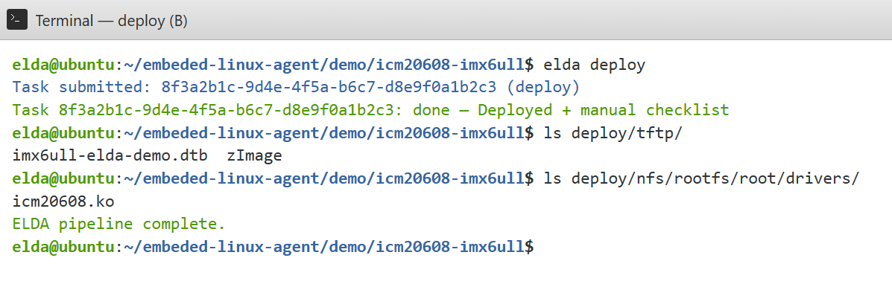</p>

**图10** `elda deploy`将`zImage`、dtb拷贝至`deploy/tftp/`，驱动模块至`deploy/nfs/rootfs/root/drivers/`，结束后显示`ELDA pipeline complete.`。

### （可选）目标板验证

将`deploy`产物按清单上板启动后，可在串口终端读取ICM20608 IIO节点，确认陀螺仪、加速度计与温度数据。

<p align="center">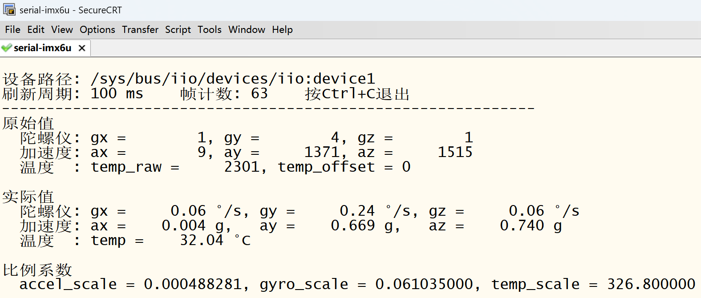</p>

**图11** 目标板运行用户态测试程序后，串口输出`/sys/bus/iio/devices/iio:device*`下的原始值、换算后的物理量及比例系数，表明驱动已正常工作。


更多细节见`README.md`与`DEPENDENCIES.txt`。